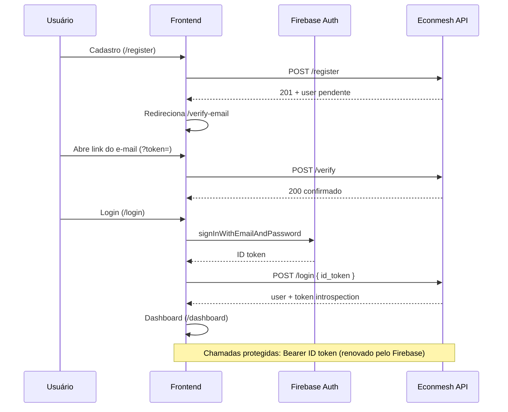

# Econmesh API — Fluxo de Autenticação (referência frontend)

Documentação derivada do código em `econmesh-api` (`src/modules/auth/`, `AUTH_ROUTES.md`). **Não inventar endpoints além desta lista.**

## Base URL

| Item | Valor |
|------|--------|
| Prefixo API | `/api/v1` |
| Módulo auth | `/auth` |
| Exemplo completo | `POST {API_URL}/api/v1/auth/register` |

## Tokens

| Tipo | Quem emite | Uso no frontend |
|------|------------|-----------------|
| **Firebase ID Token** | Firebase Auth (após `signInWithEmailAndPassword`) | Enviado em `POST /login` (`id_token`) e como `Authorization: Bearer` nas rotas protegidas |
| **Access/Refresh token da API** | **Não existe** | Renovação via Firebase SDK (`onIdTokenChanged` / `getIdToken(true)`) |
| **Token de verificação de conta** | API (e-mail / dev) | Query `?token=` → corpo de `POST /verify` |

A API **não devolve** um JWT próprio no login; retorna introspecção do ID token (`LoginResponse.token`).

## Rotas

### `POST /api/v1/auth/register` (201)

**Body (`RegisterRequest`):**

```json
{
  "full_name": "string (2-120)",
  "email": "email",
  "phone": "string | null (opcional)",
  "password": "string (8-128)",
  "password_confirm": "string | null (opcional)"
}
```

**Resposta (`RegisterResponse`):** `user` (`MeResponse`), `message`, `verification_token` (apenas `development` / `test`).

**Erros comuns:** `409 email_already_exists`, `401 invalid_credentials`, `422 validation_error`.

---

### `POST /api/v1/auth/verify` (200)

**Body:** `{ "token": "string (min 16)" }`

**Resposta:** `{ "message": "Account confirmed. You can now sign in." }`

**Erros:** `401 invalid_verification_token`, `verification_token_used`, `verification_token_expired`.

---

### `POST /api/v1/auth/resend-verification` (200)

**Body:** `{ "email": "email" }`

**Resposta:** mensagem genérica (anti-enumeration). Em dev/test, `data.verification_token` pode vir no corpo quando o e-mail foi reenviado.

---

### `POST /api/v1/auth/login` (200)

**Body:** `{ "id_token": "Firebase ID token" }`

**Resposta (`LoginResponse`):** `user` + `token` (uid, issuer, audience, expires_at, issued_at, email_verified).

**Erros:** `403 account_not_verified`, `403 account_disabled`, `401 session_revoked`, `401 token_*`.

**Pré-requisito:** conta confirmada (`is_verified` no Mongo / fluxo `POST /verify`).

---

### `GET /api/v1/auth/me` (200)

**Header:** `Authorization: Bearer <firebase_id_token>`

**Resposta (`MeResponse`):** `id`, `firebase_uid`, `email`, `name`, `phone`, `picture`, `email_verified`, `is_verified`, `role`, `is_active`, `created_at`, `updated_at`, `last_login_at`.

---

### `POST /api/v1/auth/logout` (200)

**Header:** Bearer obrigatório.

**Efeito:** invalida sessão Redis; marca revogação local (bloqueia **novos** logins até expirar flag).

---

### `POST /api/v1/auth/revoke-all` (200)

Revoga refresh tokens no Firebase + logout local.

---

### Recuperação de senha

**Não há rotas na API.** Usar **Firebase Client SDK**:

- `sendPasswordResetEmail(auth, email)`
- `confirmPasswordReset(auth, oobCode, newPassword)` na página `/reset-password` (parâmetros `oobCode` e `mode` na URL do Firebase).

## Formato de erro

```json
{
  "code": "machine_readable_code",
  "message": "Human-readable description.",
  "request_id": "string | null",
  "details": { }
}
```

| HTTP | Códigos relevantes |
|------|-------------------|
| 401 | `missing_token`, `token_expired`, `token_revoked`, `token_invalid`, `session_revoked`, `invalid_verification_token`, … |
| 403 | `account_not_verified`, `account_disabled`, `role_required` |
| 404 | `user_not_found` |
| 409 | `email_already_exists` |
| 422 | `validation_error` (+ `details.errors`) |
| 429 | `rate_limited` |

## Fluxo recomendado (cliente web)



## Papel padrão

Auto-cadastro: `viewer`. Admin cria usuários via `POST /admin/users` (fora do escopo do app público).

## Variáveis de ambiente (API)

- `FRONTEND_VERIFY_URL` — base do link de confirmação (ex.: `https://app.econmesh.com/verify-email?token=...`)
- Firebase Admin: `FIREBASE_CREDENTIALS_PATH` ou `FIREBASE_CREDENTIALS_JSON`
